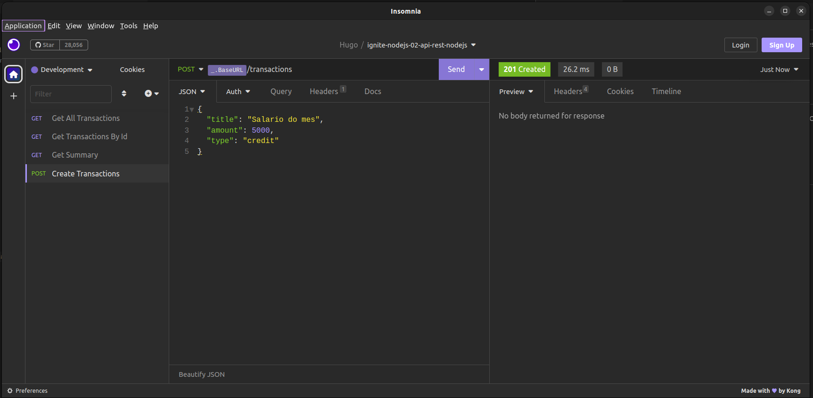
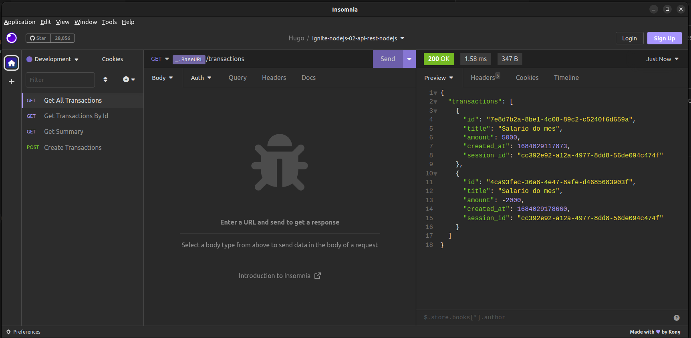
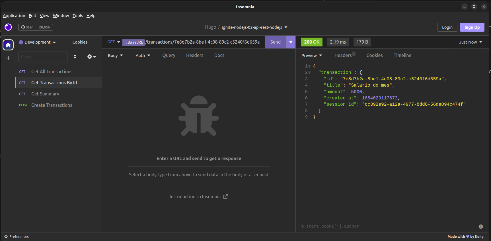

# Ignite NodeJS Chapter 2 💛🚀

<p align="center">Feito por Hugo Alves Varella</p>

<p>Feito deploy na plataforma Render - plano free para 90 dias</p>

- [Link da aplicação online](https://ignite-nodejs-02-api-ju1w.onrender.com)

<h1 align="center">
  
  
  
  
</h1>

<p align="center">
  <a href="#-tecnologias">Tecnologias</a>&nbsp;&nbsp;&nbsp;|&nbsp;&nbsp;&nbsp;
  <a href="#-projeto">Projeto</a>&nbsp;&nbsp;&nbsp;|&nbsp;&nbsp;&nbsp;a
  <a href="#-como-executar">Como executar</a>&nbsp;&nbsp;&nbsp;|&nbsp;&nbsp;&nbsp;
</p>

## ✨ Tecnologias

Esse projeto foi desenvolvido com as seguintes tecnologias:

- [NodeJS](https://nodejs.org/en)
- [Fastify](https://www.fastify.io/)
- [Typescript](https://www.typescriptlang.org/)
- [Knex](https://knexjs.org/)
- [Tsx](https://github.com/esbuild-kit/tsx)
- [Tsup](https://github.com/egoist/tsup)
- [Zod](https://github.com/colinhacks/zod)
- [Postgres](https://www.postgresql.org/)
- [SQLite](https://sqlite.org/index.html)
- [Vitest](https://vitest.dev/)
- [Supertest](https://github.com/ladjs/supertest)
- [Eslint](https://eslint.org/)

<br/>

## 📚 Informações sobre o projeto

- Esse projeto foi desenvolvido durante uma Aula do chapter 2 da trilha ignite de NodeJs da rocketseat.

<br/>

## ⚙️ Instalação

```
# Abra um terminal e copie este repositório com o comando
$ git clone https://github.com/Hugovarellaa/ignite-02-api-rest-nodejs
```

```
# Acesse a pasta da aplicação

# Instale as dependências
$ yarn
ou
$ npm install

# Criar as tabelas no banco de dados
$ npm run knex -- migrate:latest
ou
$ yarn knex -- migrate:latest

# Inicie o Projeto
$ npm run dev
ou
$ yarn
```

---

## ⚙️ Requisitos Funcionais(RF)

- [x] O usuário deve poder criar uma conta;

- [x] O usuário deve poder obter um extrato da sua conta;

- [x] O usuário deve poder listar todas transações que já ocorreram;

- [x] O usuário deve poder visualizar uma transação única;

## ⚙️ Regras de Negócios(RN)

- [x] A transação pode do tipo crédito que somará ao valor total, ou débito que será subtraído;

- [x] Deve ser possível identificar o usuário entre as requisições;

- [x] O usuário só pode visualizar transações que ele criou;

## ⚙️ Regras Não Funcionais(RNF)

- [x] Será criado ao longo da aplicação;
